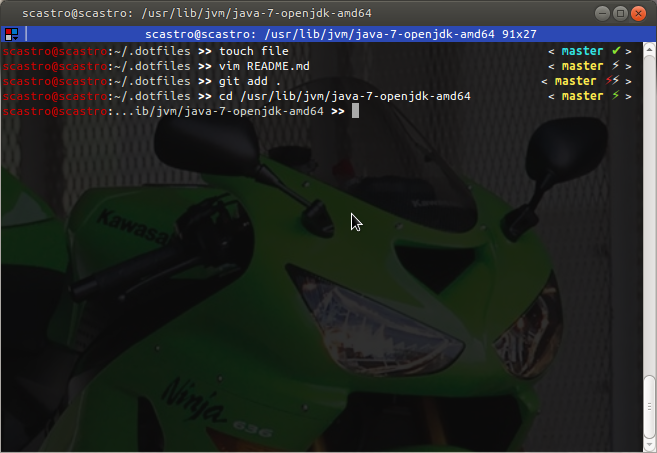

dotfiles
========
my dot files ^^

# Installation

clone the repo and run [setup/setup.sh](setup/setup.sh) scritp

or simply donwload and run [install.sh](install.sh) script by:
```
wget https://raw.githubusercontent.com/sergicastro/dotfiles/master/install.sh
chmod +x install.sh
./install.sh
```

### requirements
* vim: `> 7.4`
* git: `> 1.8.2.3` (pre-push)

###zsh


